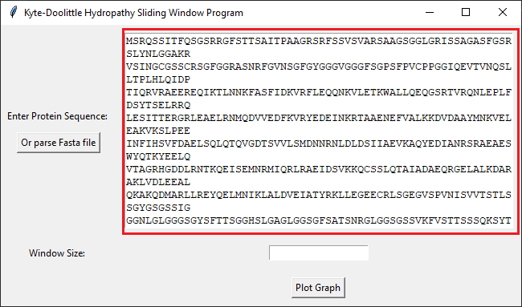
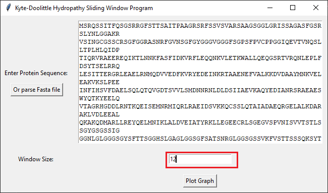

# Kyte Doolittle Sliding Window Program
This program uses the Kyte-Doolittle scale to draw hydrophobicity plots for sequences of amino acids/proteins.

## Dependencies


Install tkinter for Python

``` sudo pacman -S tk``` or  ``` sudo apt-get install tk ``` or else for othes os  

Install all python libs 

```pip install -r requirements.txt```

## Usage
<br />

There are two options: you can either copy/paste your sequence into the text box or parse a FASTA or text file containing
the sequence. If the FASTA file has a description, it will be added to the graph as a subtitle.

### Step 1: Enter your sequence 


### Step 2: Enter your window size


### Step 3: Plot the graph

 
